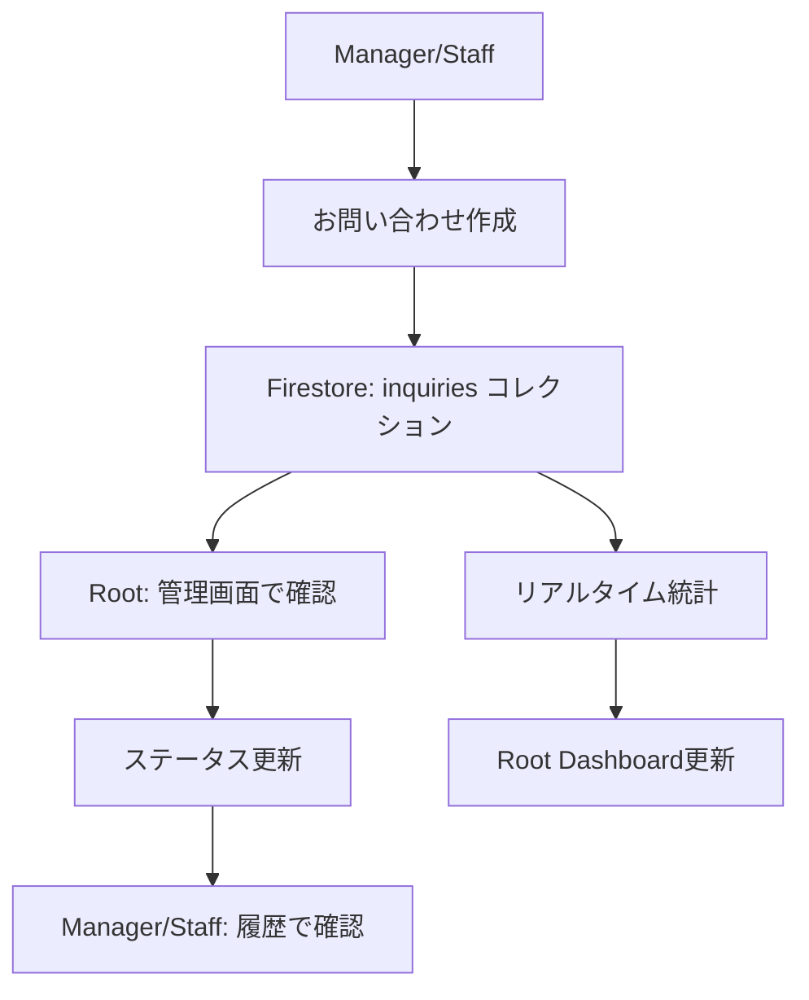

# お問い合わせシステム 設計・実装ガイド

## システム概要

### 現在の実装状況
- **管理画面 (Root)**: 完全実装済み (`/root/logs`)
- **Manager画面**: 未実装
- **Staff画面**: 未実装
- **データベース**: Firebaseの `inquiries` コレクション使用

## データベーススキーマ

### 現在のスキーマ（実装済み）

#### `inquiries` コレクション

```typescript
interface InquiryEntry {
  id: string;                                    // ドキュメントID
  timestamp: Date;                               // 送信日時
  fromRole: 'manager' | 'staff';                // 送信者ロール
  fromUserId: string;                           // 送信者UID
  fromUserName: string;                         // 送信者名
  subject: string;                              // 件名
  message: string;                              // 内容
  status: 'unread' | 'read' | 'resolved';     // 処理状況
  category: 'technical' | 'schedule' | 'policy' | 'other'; // カテゴリ
  priority: 'low' | 'normal' | 'high' | 'urgent';         // 優先度
  shopName?: string;                            // 店舗名（Manager用）
  shopId?: string;                              // 店舗ID（Manager用）

  // 管理用フィールド（Root機能で自動付与）
  readAt?: Date;                                // 既読日時
  readBy?: string;                              // 既読者UID
  resolvedAt?: Date;                            // 解決日時
  resolvedBy?: string;                          // 解決者UID
}
```

### 推奨データベース設計

#### 1. セキュリティルール設定

```javascript
// Firestore Security Rules
rules_version = '2';
service cloud.firestore {
  match /databases/{database}/documents {
    match /inquiries/{document} {
      // Root: 全権限
      allow read, write: if request.auth != null &&
        get(/databases/$(database)/documents/users/$(request.auth.uid)).data.role == 'root';

      // Manager/Staff: 自分の投稿のみ作成・読み取り可能
      allow create, read: if request.auth != null &&
        (get(/databases/$(database)/documents/users/$(request.auth.uid)).data.role in ['manager', 'staff']) &&
        resource.data.fromUserId == request.auth.uid;
    }
  }
}
```

#### 2. インデックス設定

```javascript
// 推奨コンポジットインデックス
inquiries: [
  { fields: ['status', 'timestamp'], order: ['status': 'asc', 'timestamp': 'desc'] },
  { fields: ['fromRole', 'timestamp'], order: ['fromRole': 'asc', 'timestamp': 'desc'] },
  { fields: ['priority', 'timestamp'], order: ['priority': 'asc', 'timestamp': 'desc'] },
  { fields: ['fromUserId', 'timestamp'], order: ['fromUserId': 'asc', 'timestamp': 'desc'] }
]
```

## Manager向け機能要件

### 機能一覧
1. **お問い合わせ送信**
   - 件名・内容入力
   - カテゴリ・優先度選択
   - 自動的にshopName/shopIdを付与

2. **送信履歴確認**
   - 自分の送信したお問い合わせ一覧
   - ステータス確認（未読・既読・解決済み）

### Manager実装案

#### ファイル構成
```
src/app/manager/
├── contact/
│   ├── page.tsx          # お問い合わせ送信・履歴ページ
│   └── components/
│       ├── ContactForm.tsx      # 送信フォーム
│       └── ContactHistory.tsx   # 履歴表示
└── lib/
    └── contactService.ts # お問い合わせ関連サービス
```

#### コード実装例

**1. お問い合わせ送信フォーム**

```typescript
// src/app/manager/contact/components/ContactForm.tsx
'use client';

import { useState } from 'react';
import { collection, addDoc, doc, getDoc } from 'firebase/firestore';
import { db } from '@/lib/firebase';
import { useAuth } from '@/contexts/AuthContext';

interface ContactFormData {
  subject: string;
  message: string;
  category: 'technical' | 'schedule' | 'policy' | 'other';
  priority: 'low' | 'normal' | 'high' | 'urgent';
}

export default function ContactForm() {
  const { currentUser } = useAuth();
  const [formData, setFormData] = useState<ContactFormData>({
    subject: '',
    message: '',
    category: 'other',
    priority: 'normal'
  });
  const [submitting, setSubmitting] = useState(false);

  const handleSubmit = async (e: React.FormEvent) => {
    e.preventDefault();
    if (!currentUser) return;

    setSubmitting(true);
    try {
      // ユーザー情報取得
      const userDoc = await getDoc(doc(db, 'users', currentUser.uid));
      const userData = userDoc.data();

      // お問い合わせ送信
      await addDoc(collection(db, 'inquiries'), {
        timestamp: new Date(),
        fromRole: 'manager',
        fromUserId: currentUser.uid,
        fromUserName: userData?.name || 'Unknown Manager',
        subject: formData.subject,
        message: formData.message,
        status: 'unread',
        category: formData.category,
        priority: formData.priority,
        shopName: userData?.shopName || '',
        shopId: userData?.shopId || currentUser.uid
      });

      // フォームリセット
      setFormData({
        subject: '',
        message: '',
        category: 'other',
        priority: 'normal'
      });

      alert('お問い合わせを送信しました');
    } catch (error) {
      console.error('Error submitting inquiry:', error);
      alert('送信に失敗しました');
    } finally {
      setSubmitting(false);
    }
  };

  return (
    <form onSubmit={handleSubmit} className="space-y-6">
      <div>
        <label className="block text-sm font-medium text-gray-700 mb-2">
          件名 <span className="text-red-500">*</span>
        </label>
        <input
          type="text"
          required
          value={formData.subject}
          onChange={(e) => setFormData({...formData, subject: e.target.value})}
          className="w-full px-3 py-2 border border-gray-300 rounded-lg focus:ring-2 focus:ring-blue-500"
          placeholder="お問い合わせ件名を入力"
        />
      </div>

      <div className="grid grid-cols-1 md:grid-cols-2 gap-4">
        <div>
          <label className="block text-sm font-medium text-gray-700 mb-2">
            カテゴリ
          </label>
          <select
            value={formData.category}
            onChange={(e) => setFormData({...formData, category: e.target.value as any})}
            className="w-full px-3 py-2 border border-gray-300 rounded-lg focus:ring-2 focus:ring-blue-500"
          >
            <option value="technical">技術的</option>
            <option value="schedule">スケジュール</option>
            <option value="policy">ポリシー</option>
            <option value="other">その他</option>
          </select>
        </div>

        <div>
          <label className="block text-sm font-medium text-gray-700 mb-2">
            優先度
          </label>
          <select
            value={formData.priority}
            onChange={(e) => setFormData({...formData, priority: e.target.value as any})}
            className="w-full px-3 py-2 border border-gray-300 rounded-lg focus:ring-2 focus:ring-blue-500"
          >
            <option value="low">低</option>
            <option value="normal">通常</option>
            <option value="high">高</option>
            <option value="urgent">緊急</option>
          </select>
        </div>
      </div>

      <div>
        <label className="block text-sm font-medium text-gray-700 mb-2">
          内容 <span className="text-red-500">*</span>
        </label>
        <textarea
          required
          rows={6}
          value={formData.message}
          onChange={(e) => setFormData({...formData, message: e.target.value})}
          className="w-full px-3 py-2 border border-gray-300 rounded-lg focus:ring-2 focus:ring-blue-500"
          placeholder="お問い合わせ内容を詳しく入力してください"
        />
      </div>

      <button
        type="submit"
        disabled={submitting || !formData.subject || !formData.message}
        className="w-full py-3 bg-blue-600 text-white rounded-lg hover:bg-blue-700 disabled:bg-gray-300 transition-colors"
      >
        {submitting ? '送信中...' : 'お問い合わせを送信'}
      </button>
    </form>
  );
}
```

**2. お問い合わせ履歴表示**

```typescript
// src/app/manager/contact/components/ContactHistory.tsx
'use client';

import { useState, useEffect } from 'react';
import { collection, query, where, orderBy, getDocs } from 'firebase/firestore';
import { db } from '@/lib/firebase';
import { useAuth } from '@/contexts/AuthContext';

interface InquiryEntry {
  id: string;
  timestamp: Date;
  subject: string;
  message: string;
  status: 'unread' | 'read' | 'resolved';
  category: string;
  priority: string;
}

export default function ContactHistory() {
  const { currentUser } = useAuth();
  const [inquiries, setInquiries] = useState<InquiryEntry[]>([]);
  const [loading, setLoading] = useState(true);

  useEffect(() => {
    const fetchInquiries = async () => {
      if (!currentUser) return;

      try {
        const q = query(
          collection(db, 'inquiries'),
          where('fromUserId', '==', currentUser.uid),
          orderBy('timestamp', 'desc')
        );

        const snapshot = await getDocs(q);
        const inquiriesData = snapshot.docs.map(doc => ({
          id: doc.id,
          ...doc.data(),
          timestamp: doc.data().timestamp?.toDate() || new Date()
        })) as InquiryEntry[];

        setInquiries(inquiriesData);
      } catch (error) {
        console.error('Error fetching inquiries:', error);
      } finally {
        setLoading(false);
      }
    };

    fetchInquiries();
  }, [currentUser]);

  const getStatusBadge = (status: string) => {
    const styles = {
      unread: 'bg-blue-100 text-blue-800',
      read: 'bg-green-100 text-green-800',
      resolved: 'bg-gray-100 text-gray-800'
    };
    const labels = {
      unread: '未読',
      read: '確認済み',
      resolved: '解決済み'
    };

    return (
      <span className={`px-2 py-1 text-xs rounded-full ${styles[status as keyof typeof styles]}`}>
        {labels[status as keyof typeof labels]}
      </span>
    );
  };

  if (loading) return <div className="text-center">読み込み中...</div>;

  return (
    <div className="space-y-4">
      <h3 className="text-lg font-semibold text-gray-900">送信履歴</h3>

      {inquiries.length === 0 ? (
        <div className="text-center py-8 text-gray-500">
          まだお問い合わせの送信履歴がありません
        </div>
      ) : (
        <div className="space-y-3">
          {inquiries.map((inquiry) => (
            <div key={inquiry.id} className="bg-white border border-gray-200 rounded-lg p-4">
              <div className="flex justify-between items-start mb-2">
                <h4 className="font-medium text-gray-900">{inquiry.subject}</h4>
                {getStatusBadge(inquiry.status)}
              </div>

              <p className="text-sm text-gray-600 mb-2 line-clamp-2">
                {inquiry.message}
              </p>

              <div className="flex justify-between text-xs text-gray-500">
                <span>{inquiry.timestamp.toLocaleDateString('ja-JP')}</span>
                <span>{inquiry.category} • {inquiry.priority}</span>
              </div>
            </div>
          ))}
        </div>
      )}
    </div>
  );
}
```

## Staff向け機能要件

### 機能一覧
1. **お問い合わせ送信**
   - 件名・内容入力
   - カテゴリ・優先度選択
   - 所属店舗情報の自動付与

2. **送信履歴確認**
   - 自分の送信したお問い合わせ一覧
   - ステータス確認

### Staff実装案

#### ファイル構成
```
src/app/staff/
├── contact/
│   ├── page.tsx          # お問い合わせ送信・履歴ページ
│   └── components/
│       ├── ContactForm.tsx      # 送信フォーム
│       └── ContactHistory.tsx   # 履歴表示
```

**Staff用フォーム実装例**

```typescript
// src/app/staff/contact/components/ContactForm.tsx
'use client';

import { useState } from 'react';
import { collection, addDoc, doc, getDoc } from 'firebase/firestore';
import { db } from '@/lib/firebase';
import { useAuth } from '@/contexts/AuthContext';

// Manager用とほぼ同じ、fromRole: 'staff' に変更
export default function StaffContactForm() {
  const { currentUser } = useAuth();
  const [formData, setFormData] = useState({
    subject: '',
    message: '',
    category: 'other' as const,
    priority: 'normal' as const
  });
  const [submitting, setSubmitting] = useState(false);

  const handleSubmit = async (e: React.FormEvent) => {
    e.preventDefault();
    if (!currentUser) return;

    setSubmitting(true);
    try {
      // ユーザー情報取得
      const userDoc = await getDoc(doc(db, 'users', currentUser.uid));
      const userData = userDoc.data();

      // 所属店舗情報を取得（Staffは所属Manager経由）
      let shopName = '';
      let shopId = '';

      if (userData?.managerId) {
        const managerDoc = await getDoc(doc(db, 'users', userData.managerId));
        const managerData = managerDoc.data();
        shopName = managerData?.shopName || '';
        shopId = userData.managerId;
      }

      // お問い合わせ送信
      await addDoc(collection(db, 'inquiries'), {
        timestamp: new Date(),
        fromRole: 'staff',
        fromUserId: currentUser.uid,
        fromUserName: userData?.name || 'Unknown Staff',
        subject: formData.subject,
        message: formData.message,
        status: 'unread',
        category: formData.category,
        priority: formData.priority,
        shopName,
        shopId
      });

      // フォームリセット
      setFormData({
        subject: '',
        message: '',
        category: 'other',
        priority: 'normal'
      });

      alert('お問い合わせを送信しました');
    } catch (error) {
      console.error('Error submitting inquiry:', error);
      alert('送信に失敗しました');
    } finally {
      setSubmitting(false);
    }
  };

  // UIは Manager用と同じ
  return (
    <form onSubmit={handleSubmit} className="space-y-6">
      {/* Manager用と同じフォームUI */}
    </form>
  );
}
```

## 統合ガイド

### 実装手順

1. **Manager側実装**
   ```bash
   # ファイル作成
   mkdir -p src/app/manager/contact/components
   touch src/app/manager/contact/page.tsx
   touch src/app/manager/contact/components/ContactForm.tsx
   touch src/app/manager/contact/components/ContactHistory.tsx
   ```

2. **Staff側実装**
   ```bash
   # ファイル作成
   mkdir -p src/app/staff/contact/components
   touch src/app/staff/contact/page.tsx
   touch src/app/staff/contact/components/ContactForm.tsx
   touch src/app/staff/contact/components/ContactHistory.tsx
   ```

3. **Firestore セキュリティルール更新**
   - 上記のセキュリティルールを適用

4. **インデックス設定**
   - Firebase Console でコンポジットインデックスを作成

### 動作フロー



### 注意事項

1. **セキュリティ**
   - 各ロールは自分の投稿のみアクセス可能
   - Root のみ全件アクセス可能

2. **パフォーマンス**
   - インデックス設定必須
   - ページング実装推奨（大量データ対応）

3. **拡張性**
   - 添付ファイル機能（将来的）
   - 返信機能（将来的）
   - 通知機能（将来的）

### 必要な依存関係

```json
{
  "dependencies": {
    "firebase": "^10.x.x",
    "lucide-react": "^0.x.x"
  }
}
```

このドキュメントに従って実装することで、統一性のあるお問い合わせシステムが構築できます。