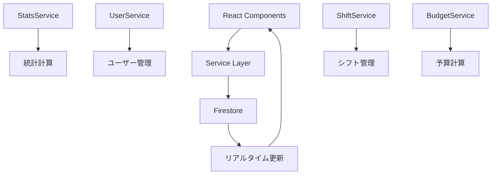

# Shifty データベースドキュメント

## 概要

このディレクトリには、Shifty システムのデータベースアーキテクチャと使用パターンに関する包括的なドキュメントが含まれています。

## ドキュメント構成

### 📋 [database-architecture.md](./database-architecture.md)
**システム全体のデータベース設計**
- Firestore アーキテクチャ概要
- コレクション設計とデータモデル
- 役割ベースアクセス制御（RBAC）
- セキュリティとコンプライアンス
- 障害対応とディザスタリカバリ

### 🔧 [root-database-usage.md](./root-database-usage.md)
**Root ルートのデータベース使用パターン**
- システム管理者向け機能
- 全権限データアクセスパターン
- 店舗横断統計とレポート
- システム監視と監査ログ
- データベース管理操作

### 🏪 [manager-database-usage.md](./manager-database-usage.md)
**Manager ルートのデータベース使用パターン**
- 店長向け機能の詳細
- managerId ベースのデータ分離
- リアルタイム統計とダッシュボード
- シフト・スタッフ・予算管理
- 承認ワークフローパターン

### ⚡ [firestore-optimization.md](./firestore-optimization.md)
**Firestore クエリ最適化戦略**
- インデックス設計と制限回避
- JavaScript側フィルタリング技法
- 並列クエリとキャッシュ戦略
- パフォーマンス監視とコスト最適化
- リアルタイム接続管理

### 🔗 [service-layer-analysis.md](./service-layer-analysis.md)
**サービス層の詳細分析**
- StatsService, UserService等の設計
- ビジネスロジックの抽象化
- 型安全性とエラーハンドリング
- サービス間連携パターン
- パフォーマンス監視とメトリクス

## 主要な設計原則

### 🎯 アクセス制御
```typescript
// Root: 全データアクセス
// Manager: managerId でフィルタリング
// Staff: 自分のデータのみ
```

### 🚀 パフォーマンス最適化
```typescript
// 1. 並列クエリ実行
const [staff, shifts, budget] = await Promise.all([...]);

// 2. JavaScript側フィルタリング
const filtered = allData.filter(item => condition);

// 3. 必要最小限のインデックス
// 複合インデックスを避け、単一フィールドクエリを活用
```

### 🔄 リアルタイム機能
```typescript
// 選択的リアルタイム監視
// 必要な場合のみ onSnapshot を使用
// 不要な接続は自動切断
```

## データフロー概要



## 主要コレクション

| コレクション | 用途 | アクセス制御 |
|------------|------|------------|
| `users` | 全ユーザー情報 | Role-based |
| `shifts` | シフトスケジュール | managerId |
| `shiftRequests` | シフト希望申請 | managerId |
| `shiftExchanges` | シフト交換 | managerId |
| `budgetCalculations` | 予算計算結果 | managerId |
| `activityLogs` | 監査ログ | Root only |
| `systemSettings` | システム設定 | Root only |

## パフォーマンス指標

- **平均クエリ時間**: < 200ms
- **ダッシュボード読み込み**: < 500ms
- **リアルタイム更新遅延**: < 100ms
- **同時接続**: 最大100店舗

## 開発者向けガイド

### 新機能開発時のチェックリスト

1. **権限チェック**: 適切な役割制限を実装
2. **インデックス**: 複合インデックス不要の設計
3. **エラーハンドリング**: フォールバック値の提供
4. **パフォーマンス**: 並列クエリの活用
5. **監査ログ**: 重要操作の記録
6. **型安全性**: TypeScript 型定義の更新

### デバッグのヒント

```typescript
// パフォーマンス計測
console.time('query-name');
const result = await queryFunction();
console.timeEnd('query-name');

// Firestore 接続状態確認
onSnapshot(doc(db, 'system', 'health'), { includeMetadataChanges: true },
  (doc) => console.log('From cache:', doc.metadata.fromCache)
);
```

## 関連リソース

- [Firebase Console](https://console.firebase.google.com/project/shifty-dc8fb/firestore)
- [インデックス管理](https://console.firebase.google.com/project/shifty-dc8fb/firestore/indexes)
- [Firestore セキュリティルール](https://console.firebase.google.com/project/shifty-dc8fb/firestore/rules)

---

**最終更新**: 2025年9月18日
**バージョン**: v2.0
**作成者**: データベースアーキテクチャチーム